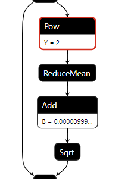

# Swin Transformer

This project aims to explore the deployment of SwinTransformer based on TensorRT, including the test results of FP16 and INT8. 

## Introduction(Quoted from the Original Project )

**Swin Transformer** [original github repo](https://github.com/microsoft/Swin-Transformer/) (the name `Swin` stands for **S**hifted **win**dow) is initially described in [arxiv](https://arxiv.org/abs/2103.14030), which capably serves as a
general-purpose backbone for computer vision. It is basically a hierarchical Transformer whose representation is
computed with shifted windows. The shifted windowing scheme brings greater efficiency by limiting self-attention
computation to non-overlapping local windows while also allowing for cross-window connection.

## Setup ##

1. Please refer to the [Data preparation](https://github.com/microsoft/Swin-Transformer/blob/main/get_started.md#data-preparation) session to prepare Imagenet-1K.

2. Docker setup.  

    a). Docker pull and launch. TensorRT 8.5.1.7 is preinstalled in this docker.
    ```
    docker pull nvcr.io/nvidia/tensorrt:22.11-py3
    docker run --name tensorrt_22.11_py3_swin -it --rm --gpus "device=0" --network host --shm-size 16g -v /($path_of_your_projects):/root/space/projects nvcr.io/nvidia/tensorrt:22.11-py3 &
    ```
    
    b). Install necessary utils:
    ```
    pip install pytorch-quantization==2.1.2 --extra-index-url https://pypi.ngc.nvidia.com
    pip install torch==1.13.0 torchvision==0.14.0
    pip install timm==0.4.12
    pip install termcolor==1.1.0
    pip install pyyaml tqdm yacs
    pip install onnx onnxruntime
    ```


## Code Structure ##  
Focus on the modifications and additions.
```
.
├── config.py                  # Add the default config of quantization and onnx export
├── export.py                  # Export the PyTorch model to ONNX format
├── calib.sh                   # Calib script
├── models
│   ├── build.py
│   ├── __init__.py
│   └── swin_transformer.py    # Build the model and add the quantization operations, modified to export the onnx and build the TensorRT engine
├── README.md
├── qat.sh                     # Execute calibration and QAT finetuning
├── trt                        # Directory for TensorRT's engine evaluation and visualization.
│   ├── debug                  # Compare scripts with polygraphy, compare the results of onnx and TRT engine with fixed input
│   ├── build_engine.py        # Script for engine build
│   ├── engine.py
│   ├── eval_trt.py            # Evaluate the tensorRT engine's accuary.
│   ├── eval_onnxrt.py         # Run the onnx model, generate the results, just for debugging
├── swin_quant_flow.py         # QAT workflow for swin_transformer, we haven't try the swin_mlp structure
└── weights
```

## Export to ONNX and Build TensorRT Engine ##
You need to pay attention to some small modifications below.  
1. For dynamic batchsize support, please refer to the modifications in `models/swin_transformer.py`. The window_reverse does not support dynamic batch because it cast the first dimension of windows to integer. 
   ```css
    def window_reverse(windows, window_size, H, W):
        # B = int(windows.shape[0] / (H * W / window_size / window_size))
        # x = windows.view(B, H // window_size, W // window_size, window_size, window_size, -1)
        # x = x.permute(0, 1, 3, 2, 4, 5).contiguous().view(B, H, W, -1)
        C = int(windows.shape[-1])
        x = windows.view(-1, H // window_size, W // window_size, window_size, window_size, C)
        x = x.permute(0, 1, 3, 2, 4, 5).contiguous().view(-1, H, W, C)
        return x
    ```
   
2. For fp16 mode, fp16 can't store very large and very small numbers like fp32. So we need to set some specific layers to fp32 during the engine build. 
   We can fallback the `POW` and `REDUCE` layers to fp32, it is enough to fix the accuracy problem and don't hurt the perfomance/throughput. 
   Sometime maybe with different weights, you need to fallback `POW`, `REDUCEMEAN`, `Add` and `Sqrt` to fp16, please refer to `fix_fp16_network` function in `trt/trt_utils.py`.   
     
   

### Possible issues for old onnx and TensorRT versions ###  
If you are using the env setting as above, just skip this.  
1. Exporting the operator roll to ONNX opset version 9 is not supported.   
   A: Please refer to [torch/onnx/symbolic_opset9.py](https://github.com/pytorch/pytorch/blob/master/torch/onnx/symbolic_opset9.py), add the support of exporting torch.roll.
   
2. Node (Concat_264) Op (Concat) [ShapeInferenceError] All inputs to Concat must have same rank.  
   A: Please refer to the modifications in `models/swin_transformer.py`. We use the input_resolution and window_size to compute the nW.
   ```css
      if mask is not None:
        nW = int(self.input_resolution[0]*self.input_resolution[1]/self.window_size[0]/self.window_size[1])
        #nW = mask.shape[0]
        #print('nW: ', nW)
        attn = attn.view(B_ // nW, nW, self.num_heads, N, N) + mask.unsqueeze(1).unsqueeze(0)
        attn = attn.view(-1, self.num_heads, N, N)
        attn = self.softmax(attn)
    ```


## Accuray Test Results on ImageNet-1K Validation Dataset ##  
1. Download the `Swin-T` pretrained model from [Model Zoo](https://github.com/microsoft/Swin-Transformer/blob/main/get_started.md#regular-imagenet-1k-trained-models). 

2.  `export.py` exports a pytorch model to onnx format.
    ```bash
    $ python export.py --eval --cfg SwinTransformer/configs/swin/swin_tiny_patch4_window7_224.yaml --resume ./weights/swin_tiny_patch4_window7_224.pth --data-path /root/space/projects/datasets/imagenet  
    ```
    
3. Build the TensorRT engine using `trtexec`.  
    ```bash
    $ python trt/build_engine.py --onnx-file ./weights/swin_tiny_patch4_window7_224.onnx --trt-engine  ./weights/swin_tiny_patch4_window7_224_batch32_fp32.engine --verbose --mode fp32 --b-opt 32
    ```  
   
   For fp16 mode.  
   ```bash
   $ python trt/build_engine.py --onnx-file ./weights/swin_tiny_patch4_window7_224.onnx --trt-engine  ./weights/swin_tiny_patch4_window7_224_batch32_fp16.engine --verbose --mode fp16 --b-opt 32
   ```  
   
   You can use the `trtexec` to test the throughput of the TensorRT engine.
   ```bash
   $ trtexec --loadEngine=./weights/swin_tiny_patch4_window7_224_batch32_fp16.engine
   ``` 

4.  `trt/eval_trt.py` aims to evalute the accuracy of the TensorRT engine.   
    ```bash
    $ python trt/eval_trt.py --engine ./weights/swin_tiny_patch4_window7_224_batch32_fp16.engine --data-path /root/space/projects/datasets/imagenet --batch-size 32
    ```  

5. `trt/eval_onnxrt.py` aims to evalute the accuracy of the Onnx model, just for debug.
   ```bash
   $ python trt/eval_onnxrt.py --eval --cfg SwinTransformer/configs/swin/swin_tiny_patch4_window7_224.yaml --resume ./weights/swin_tiny_patch4_window7_224_fixed.onnx --data-path /root/space/projects/datasets/imagenet --batch-size 32
   ```  
   
## New Test Attached ##
Accuracy and Speedup Test of TensorRT engine (A100 40GB, TensorRT 8.5.1.7)    
  
| Model (BS=32)	| FP32(latency: mean) 	| FP16(latency: mean)  |	FP16 Acc.1 | 
| :---: | :---: | :---: | :---: |
Swin Tiny  |	14.2938 ms	  |8.87109 ms	  |81.20%  |
Swin Small  |	22.9841 ms	  |12.9888 ms	  |83.20%  |
Swin Base  |	31.4782 ms	  |17.3515 ms	  |85.20%  |
Swin Large  |	53.5593 ms  |	27.6452 ms	  |86.20%  |

For int8, after calibration, the accuray is 80.8% with swin-tiny, just as expected. But the speedup is not obvious.
So fp16 deployment is highly recommended.
   

## Previous Test Attached ##
Accuracy Test of TensorRT engine (T4, TensorRT 8.2)   
  
| SwinTransformer(T4) | Acc@1 | Notes |
| :---: | :---: | :---: |
| PyTorch Pretrained Model |  81.160 |  |
| TensorRT Engine(FP32) | 81.156 |  |
| TensorRT Engine(FP16) | 81.150 | With `POW` and `REDUCE` layers fallback to FP32 |
| TensorRT Engine(INT8 QAT) | - | Finetune for 1 epoch, got 79.980, need to improve the int8 throughput first |


Speed Test of TensorRT engine (T4, TensorRT 8.2)  
  
| SwinTransformer(T4) | FP32 | FP16 | Explicit Quantization(INT8, QAT) |
| :---: | :---: | :---: | :---: |
| batchsize=1 | 245.388 qps | 510.072 qps | 385.454 qps |
| batchsize=16 | 316.8624 qps | 804.112 qps | 815.606 qps |
| batchsize=64 | 329.13984 qps | 833.4208 qps | 780.006 qps |
| batchsize=256 | 331.9808 qps | 844.10752 qps | - |

Result:   
1. Now the accuracy and speedup of FP16 is as expected, it is highly recommended to deploy Swin-Transformer with FP16 precision.
 
2. Compared with FP16, INT8 does not speed up at present.  

## Add Quantizer and Wrap the Fake-Quantized Model (Experiment) ##
The main modifications of `models/swin_transformer.py` are as below.  
1. For `PatchMerging` block, modify `torch.nn.Liner` to `quant_nn.QuantLinear`.  
 
2. For `WindowAttention` block,   
   a) For query, key and value, modify `torch.nn.Liner` to `quant_nn.QuantLinear`.  
   b) Quantize the four inputs of `torch.matmul`.  
   
3. For `MLP` block, modify `torch.nn.Liner` to `quant_nn.QuantLinear`.  
   
4. For `SwinTransformerBlock` block, quantize the inputs of operator `+`.


## QAT for Swin Transformer (Experiment) ##  
In order to do the QAT finetuning, some utils are needed to install.  
`tqdm`, `prettytable`, `scipy`, `absl-py`  

1. With `swin_quant_flow.py`, wrap a fake-quantized model, calibrate, QAT finetuning and export to onnx model.
   ```bash
   $ ./calib.sh
   ```  
   Or you can run calibration and QAT-finetuning in the same time.
      ```bash
   $ ./qat.sh
   ```  

2. Build TensorRT engine and evaluate as above. Same commands.